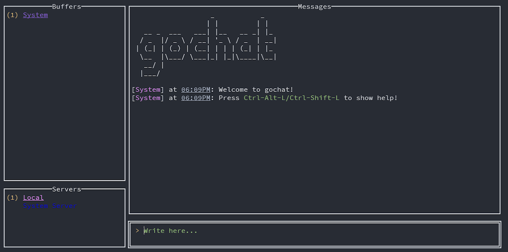
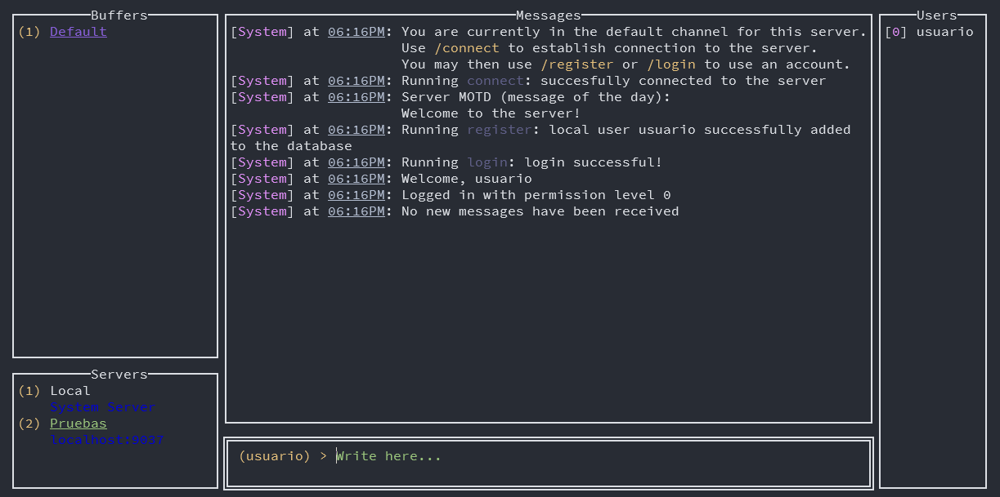
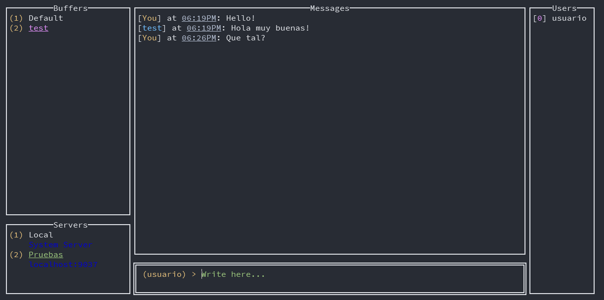

# gochat TUI Quickstart Guide
*(Last revision: 29-06-2025)*

The gochat client offers a **Terminal User Interface** (TUI for short) designed for its ease of use and customisation!

## Run

In order to run the program you do not need to provide any additional arguments.

## First steps

### The Local Server

Once you open the program you will be greeted with a welcome message. You can see a help window with an exhaustive list of key combinations and commands using `Ctrl-Shift/Alt-L` If you look at the *bottom left* you will see your server list and in the *top left* the buffer list. The TUI refers to buffers as independent instances for messaging, similar to the concept of "channels". The TUI automatically creates a non-persitant "Local" server for important system messages and basic usage. Anything done in the "Local" server will not persist between sessions, so feel free to experiment!

### Adding a new server

Different key combinations are available to interact with the different components in the TUI. Mainly, `Ctrl-T` is used to switch between the text and input window, `Ctrl-K` focuses the buffer list and `Ctrl-S` focuses the server list. Once you focus a component you will have different keybinds available for different tasks. pressing `Ctrl-N` while on the server list you will open the popup to create a new server. Follow the instructions on the prompts to create the server.

### Connection and registration

New servers will have a "Default" system buffer used for system messages, you can use that to start running commands. Using `/connect` will connect you to the server, which if successful will make the server name turn green in the server list.

After connection you must create an account using `/register <username>`. The TUI will ask for a password and a confirmation of said password. It is important to note that created accounts are only available on that server and no other.

Once registered you can log in using `/login <username>` which will ask for the password of the given account and log you into the server. If the login is successful you will see that a new bar will appear to the *right side*, showing the list of online users in the server.

### Talking to a user

The protocol so far only supports conversations between 2 people. If you wish to talk to a user you can see the list of available users in the server with `/users remote <all/online>`. 

Now, by focusing the buffer list (using `Ctrl-K` as said before) and pressing `Ctrl-N` will allow you to create a new buffer with the given username. If the creation is successful and the given user exists, you will get a new empty buffer where you can start talking to that user. Messages will be saved locally and will persist between sessions.

## Important Notes

You can use `/logout` and `/disconnect` to log out of your account and disconnect from the server respectively. This will remove from the list all users you were having a conversation with. To recreate them you must log in again.

Using `Ctrl-G` you can quickly switch between buffers on a server by typing the name of the buffer.

If the TUI seems unresponsive or looks broken, press `Ctrl-R` to redraw the screen.

You can quickly switch between servers with `Shift-Up/Down` and between buffers with `Alt-Up/Down`

Please consult and read the **help page** carefully if you have any other doubts.